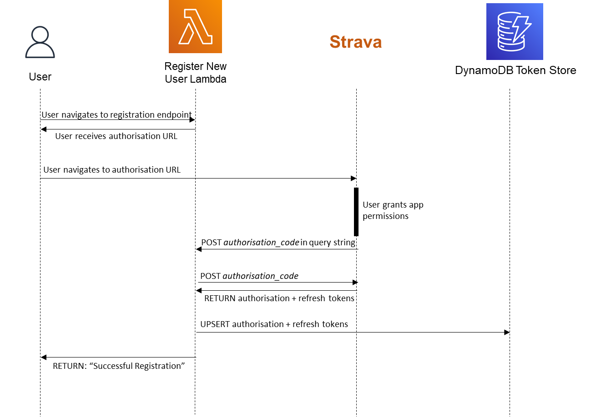
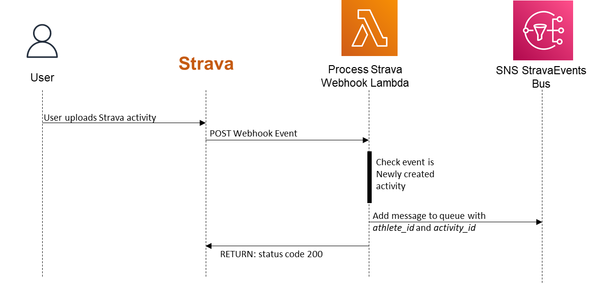
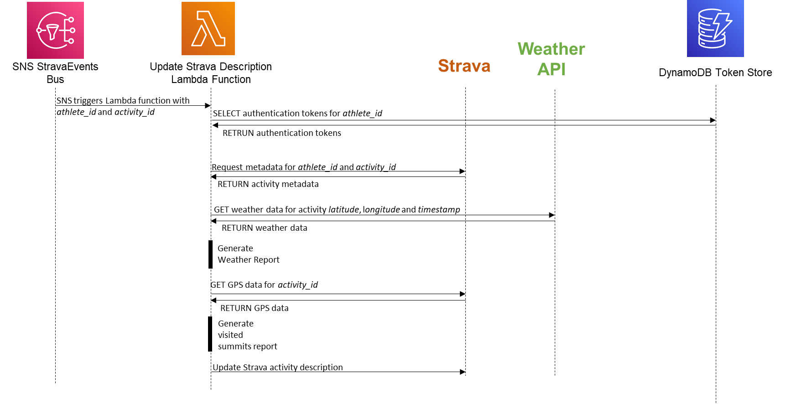

# Strava Summit Reports

An AWS-hosted web app that automatically edits Strava activities with a summary report of visited summits from the 
[database of British and Irish Hills](http://www.hills-database.co.uk/downloads.html), according to their summit 
classification, and a description of the weather during the activity, generated using [weatherapi](https://www.weatherapi.com/).

### How can I Use it?

To register for the app: 
 - visit this the 
[user registration endpoint](https://qbyrryqldqqzco3zsfitqirqlu0xcino.lambda-url.eu-west-2.on.aws/) to generate your 
sign-up link. 
 - Navigate to the `Authorisation url` property from the returned `JSON`.  
 - You should be directed to a Strava login page. Login and Authorise the app to access your user profile
 - You should then be redirected back to the app. If registration has been successful, you should see the message 
`Successfully registered athlete with ID <YOUR ATHLETE ID>`
 - All of your Strava activities will now be automatically updated with summit and weather reports

*Please note, this is a hobby project, and I am trying to keep costs low. There is currently a hard limit on the number 
of registered users of 5. If you instead see the message `Unable to register athlete.`, it is likely this hard limit
has been exceeded.*

### How does it work?

When a user registers for the app, strava generates an `authorisation_code`, which can be used to retrieve an 
`authorisation_token` and a `refresh_token` from Strava (details regarding token exchange and refreshing expired tokens 
are given in the [Strava API documentation](https://developers.strava.com/docs/authentication/#tokenexchange)). These 
tokens are unique per registered user, and are stored in a `DynamoDB` table at the time of registration:



The app is registered for the [Strava webhook events API](https://developers.strava.com/docs/webhooks/). When a user 
uploads a new activity to Strava, the events API triggers the `process_strava_webhook` Lambda functionm which adds a 
notification to an AWS `SNS` storage service if the event is a newly-created activity: 



The `SNS` service is used here so that processing can be done asynchronously, and so that the Strava webhook events API 
can receive a timely response. The `SNS` service triggers the `update_strava_description` lambda function, which:

1. Reads the `athlete_id` and `activity_id` from the notification
2. Requests the corresponding activity metadata from Strava
3. Extracts the start point latitude, longitude and start and end timestamps from the metadata
4. Sends a request to [WeatherAPI](https://www.weatherapi.com/) to retrieve weather data for the activity
5. Generates a summary weather report using the returned data
6. Requests the GPS coordinate trail from the Strava API
7. Runs a nearest-neighbour search of GPS coordinates against the 
[database of British and Irish hills](http://www.hills-database.co.uk/downloads.html) and extracts any summits that 
were visited in the GPS trail.
8. Generates a report of visited summits by classification, according to the configuration defined in 
`src/summits/report_configuration.py`
9. Concatenates the weather and summit reports, and updates the strava activity description


### Deployment Details

#### Lambda Functions
The Lambda endpoints themselves are defined in the top-level scripts of the `src` folder. To deploy a Lambda endpoint,
save the contents of `src` as a `.zip` file and upload the package [as detailed in the AWS documentation](https://docs.aws.amazon.com/lambda/latest/dg/python-package.html). 


#### Dependencies
The app is hosted in AWS Lambda. To ensure compatibility with the AWS Lambda environment, dependencies are built using
an amazonlinux Docker image, and uploaded as a lambda layer. To deploy dependencies, first build the packages
using Docker:
1. Build and run the docker image defined in `Dockerfile`:

```
docker build -t awslayerdocker .
docker run -it awslayerdocker bash
```
2. Navigate to the installed python packages and create a `.zip` file:
```
cd ..
cd ./layer_dir
zip -r docker_layer.zip .
```
3. Exit the container using `Ctrl + P + Q` 
4. Identify the running container ID using `docker container ls`
5. Copy the `.zip` file onto the host machine:
```
docker cp <container ID>:/layer_dir/docker_layer.zip ./
```
6. Deploy the Lambda layer, following the [instructions in the AWS documentation](https://docs.aws.amazon.com/lambda/latest/dg/configuration-layers.html#configuration-layers-create).